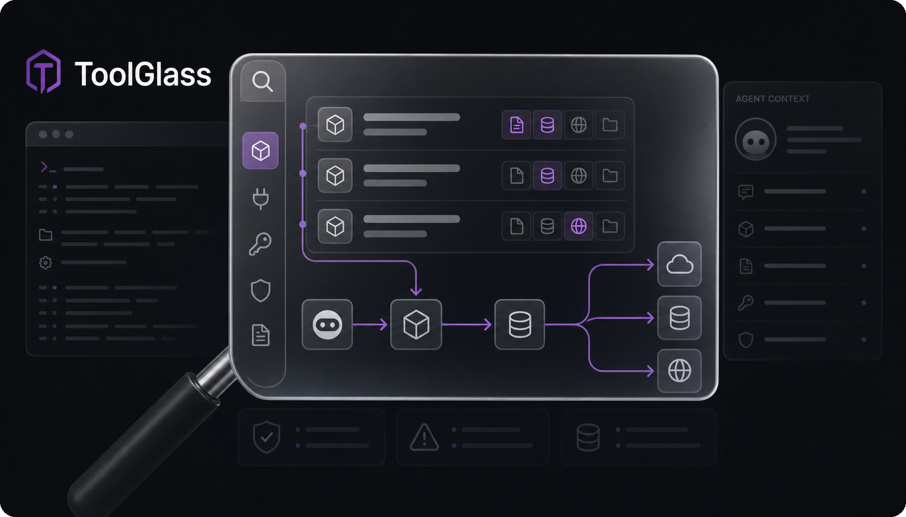

<p align="center"></p>

# ToolGlass

**让你看清:你的 agent 到底看到了什么。** 一个本地、离线优先的 Rust 审计工具,揭示 AI 编码助手(**Claude Code、Cursor、Codex、VS Code、Cline、goose**)暴露给模型的 MCP 工具面:描述、环境变量、授权状态、投毒信号与外泄路径,在它真正运行**之前**。

`本地优先 · 离线 · 只检测不拦截 · 跨客户端 · 单二进制`

[English](README.md) · **中文**

[](https://www.rust-lang.org/)
[](LICENSE)
[](#状态)
[](#)

<p align="center"></p>

---

ToolGlass **不是又一个扫描器**。它是一份「Agent 可见面」报告:透明、本地、可 diff,并以单个 Rust 二进制发布。不上传任何数据;除非你显式开启实时探测,不会执行任何 MCP server。

## 状态

**可发布的 Rust crate。** ToolGlass 目前支持 6 个客户端的配置扫描、stdio MCP server 的实时
`tools/list` 探测、工具投毒检测(TG-101/102/103)、跨 server 外泄路径图、安全演示,以及终端/Markdown/HTML/SARIF/JSON 报告。Rust 核心已有测试覆盖,GitHub Action 会生成用于 code scanning 的 SARIF。

## 技术栈

- Rust crate:`tool-glass`
- 二进制:`tool-glass`
- 报告:`terminal`、`md`、`html`、`sarif`、`json`
- 客户端:Claude Code、Cursor、Codex、VS Code、Cline、goose
- 当前分发:预编译 release 二进制或源码构建

## 为什么做

MCP 工具是**模型可控**的:agent 会读取那些你在客户端 UI 里根本看不到的工具描述与 `instructions`。ToolGlass 在本地把这些原样打印出来,让你像看 diff 一样,在信任第三方 MCP server 之前先审一遍。

和托管的扫描器(如 Snyk Agent Scan / Invariant MCP-Scan)不同,ToolGlass **开源、完全本地、离线**:你的工具描述绝不会离开你的机器。它强调的是「解释」(Agent 可见面报告 + 外泄路径图),而不是托管策略执行。Snyk 是覆盖面很广的商业 AppSec 平台;ToolGlass 是一个小而本地的视角,专注于 AI agent 能看到什么,以及工具描述如何影响它们。

## 安装

从 [Releases](https://github.com/Loping151/tool_glass/releases) 下载对应平台的预编译二进制,
解压后把 `tool-glass` 或 `tool-glass.exe` 放进 `PATH`。

也可以用 Cargo 从源码安装:

```bash
cargo install --path .
tool-glass --version
```

或者在本地构建 release 二进制:

```bash
cargo build --release
./target/release/tool-glass --version
```

本地 release 构建会在类 Unix 系统产出 `target/release/tool-glass`,在 Windows 产出
`target/release/tool-glass.exe`。

## 快速开始

扫描本机配置:

```bash
cargo run --quiet -- scan
cargo run --quiet -- scan --report json
```

扫描指定项目或配置根目录:

```bash
cargo run --quiet -- scan --cwd .
cargo run --quiet -- scan --home /path/to/home --cwd /path/to/project
```

写出报告:

```bash
cargo run --quiet -- scan --report md -o tool_glass.md
cargo run --quiet -- scan --report html -o tool_glass.html
cargo run --quiet -- scan --report sarif -o tool_glass.sarif
```

`cargo build --release` 后使用编译出的二进制:

```bash
./target/release/tool-glass scan --cwd . --report sarif -o tool_glass.sarif
```

实时探测需要显式开启:

```bash
cargo run --quiet -- scan --cwd . --live --yes
```

## 演示

零配置看到攻击长什么样:

```bash
cargo run --quiet -- demo
```

或使用 release 二进制:

```bash
./target/release/tool-glass demo
```

ToolGlass 会探测两个内置的假 MCP server。一个看似无害的天气工具,会被还原出它藏着一条给模型的隐形指令:让它去读一个私密文件,再把内容发给一个聊天工具;并且 ToolGlass 会画出 `get_weather -> send_message` 的外泄路径。全程不执行任何东西:路径只是被**揭示**,而非**运行**。

## CI / GitHub Action

在每次 PR 上审计 MCP 配置,并把发现投递到 **Security** 标签页。

**可复用 action**(用于公开仓库):

```yaml
# .github/workflows/tool_glass.yml
name: tool_glass
on: [pull_request, push]
permissions:
  contents: read
  security-events: write
jobs:
  audit:
    runs-on: ubuntu-latest
    steps:
      - uses: actions/checkout@v4
      - uses: Loping151/tool_glass@main
        with:
          path: .
      - uses: github/codeql-action/upload-sarif@v3
        with:
          sarif_file: tool_glass.sarif
          category: tool_glass
```

composite action 会安装 stable Rust toolchain,执行 `cargo build --release`,然后运行:

```bash
target/release/tool-glass scan --cwd <path> --report sarif -o <sarif-path>
```

并把 SARIF 路径作为 `sarif` 输出。本仓库也自带 `.github/workflows/tool_glass.yml`,会执行 `cargo test`、构建 release 二进制、扫描仓库并上传 SARIF。发现默认只做标注,不会阻断构建。

## 路线图

- [x] 配置扫描:Claude Code、Cursor、Codex、VS Code、Cline、goose
- [x] 实时 `tools/list` 探测(stdio、受限环境、从不调用工具)
- [x] 工具投毒规则(TG-101/102/103)+ 跨 server 外泄路径图
- [x] 报告:终端、Markdown、HTML、SARIF、JSON
- [x] GitHub Action 与 SARIF 上传 workflow
- [ ] 基线 diff(CI 只对新引入风险失败)
- [ ] 更多客户端(Windsurf、Zed)
- [ ] crates.io 包

## 免责

ToolGlass 只审计**你自己的本地配置**。默认从不执行 MCP server、从不读取 secret 的**值**(只取环境变量名)、从不触网。实时探测需要显式开启,并且仅限于从发现到的 stdio MCP server 列出工具。
